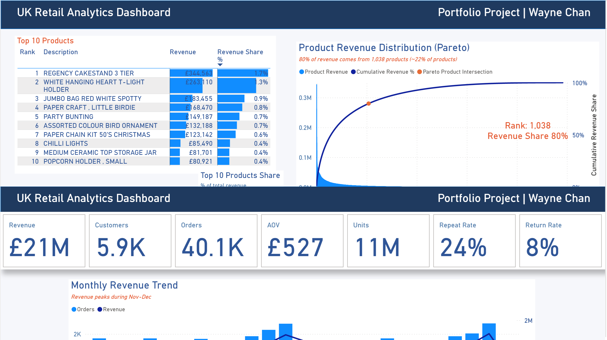
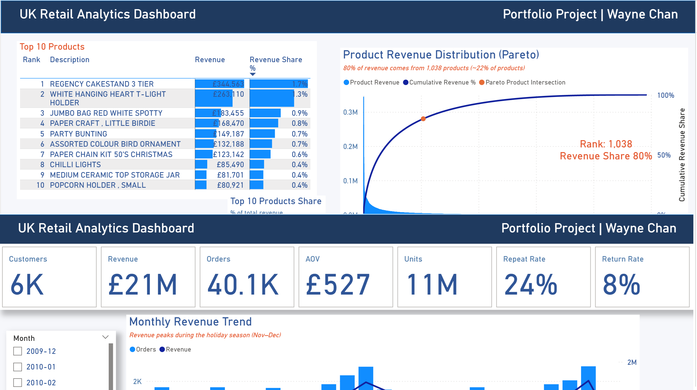
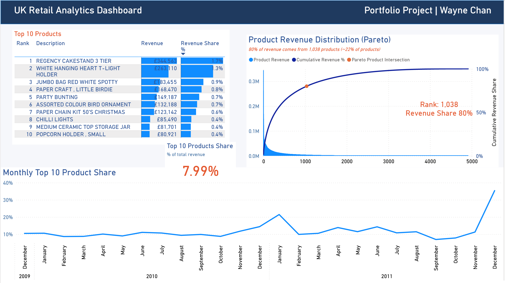
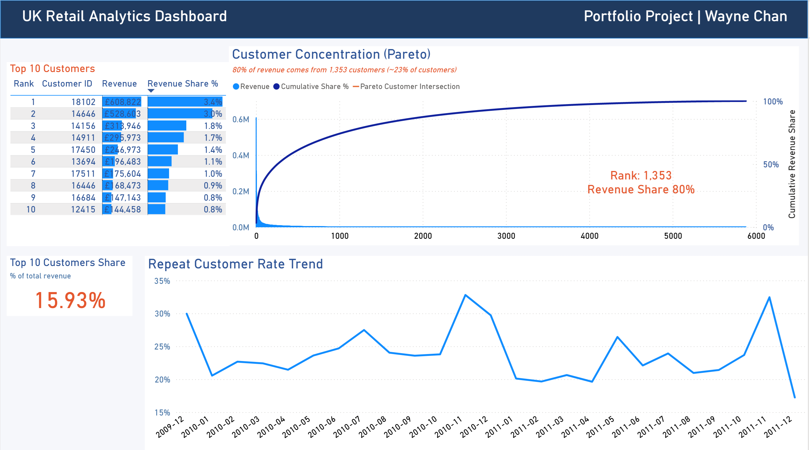

# UK Retail Analytics Dashboard

This project analyzes an online retail dataset using **Google BigQuery** and **Power BI**.

## Tools
- SQL (BigQuery)
- Power BI
- Data Modeling
- Pareto Analysis

## Data Pipeline

Raw Data → Cleaned Data → Fact Tables → KPI Views → Power BI Dashboard

## Dashboard Pages

### Overview
Key business metrics including revenue, orders, AOV, repeat rate, and return rate.

### Product Analysis
Product performance and revenue concentration using Pareto analysis.

### Customer Analysis
Customer revenue distribution and repeat purchase behavior.

## Key Insights

- Revenue shows strong seasonality with peaks during the holiday period.
- Product revenue follows a long-tail distribution:
  80% of revenue comes from the top **1,038 products (~21%)**.
- Customer revenue is concentrated:
  80% of revenue comes from **1,353 customers (~23%)**.
- Repeat purchase rate averages **24%**.

## Dashboard Preview

## Author
Wayne Chan